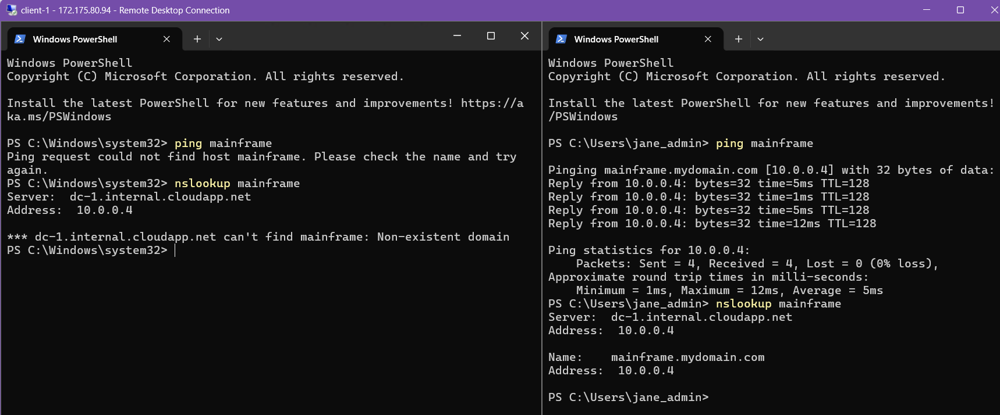
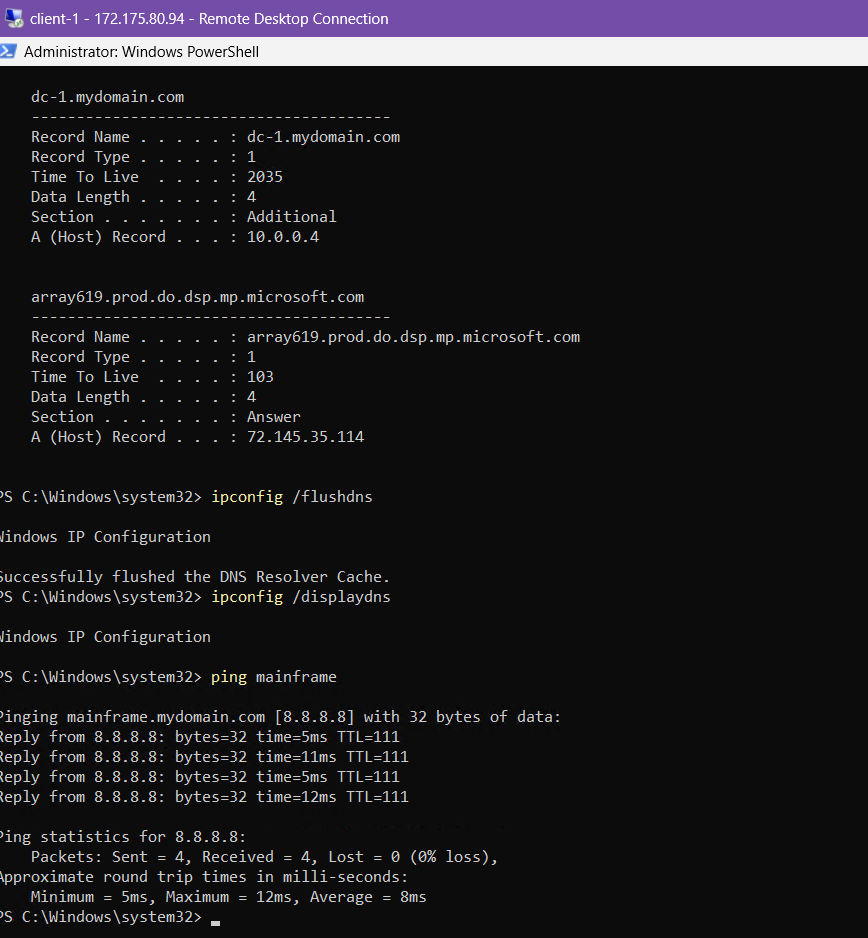
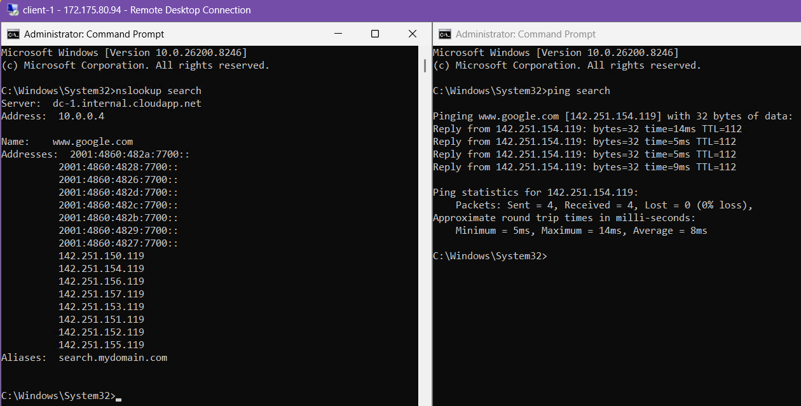

# Azure Active Directory: DNS Record Management & Resolution Lab

---

## Introduction
This lab demonstrates the configuration and troubleshooting of **Domain Name System (DNS)** services within an Azure-hosted Windows environment. By managing A-Records, CNAME aliases, and the local resolver cache, this project illustrates how name resolution facilitates communication between nodes in an Active Directory forest.

---

## Technical Skills & Tools

* **Windows Server 2022:** Managing the Primary Domain Controller and Authoritative DNS Server.
* **DNS Manager (MMC):** Configuring A-Records, CNAME aliases, and managing Forward Lookup Zones.
* **Network Troubleshooting:** Diagnosing resolution issues using `nslookup`, `ping`, and `tracert`.
* **Local Resolver Cache Management:** Manipulating the client-side DNS cache using `ipconfig /displaydns` and `ipconfig /flushdns`.
* **Microsoft Azure:** Managing Virtual Machines and Virtual Network (VNet) settings for cloud-based identity services.
---

## Part 1: A-Record Configuration & Name Resolution
The first phase involved establishing a manual Host (A) record within the Domain Controller to map a custom hostname to a specific IP address. This exercise demonstrates the fundamental "Phonebook" mechanic of DNS.
* **Connectivity Baseline:** Attempted to resolve the hostname "mainframe" from Client-1 using `nslookup`. Initial attempts failed, confirming that no record existed within the authoritative zone.
* **Record Provisioning:** Created a new A-Record on DC-1, mapping "mainframe" to the Domain Controller's private IP.
* **Resolution Verification:** Confirmed successful resolution on the client side via `ping`. This verified that the workstation was correctly querying DC-1 for internal name resolution.

  

---

## Part 2: DNS Cache Dynamics & Troubleshooting
This section focuses on the behaviour of the local resolver cache and how "stale" data can cause connectivity issues even after a DNS record is updated.
* **Simulated Propagation Delay:** Modified the "mainframe" record on DC-1 to point to a different IP (8.8.8.8). Observations showed the client still pinged the old address due to the local cache.
* **Cache Inspection:** Utilized `ipconfig /displaydns` to view the active TTL (Time to Live) and existing entries stored locally on the workstation.
* **Forced Invalidation:** Performed an `ipconfig /flushdns` to clear the resolver cache. This forced the client to request the updated record from the DNS server, resolving the addressing mismatch.

  

---

## Part 3: CNAME Implementation & Alias Routing
The final phase implemented Canonical Name (CNAME) records to create aliases for existing hostnames, demonstrating how to route traffic to external FQDNs using internal names.
* **Alias Creation:** Configured a CNAME record on DC-1 to map the internal host "search" to "www.google.com".
* **Resolution Chain Analysis:** Used `nslookup` on Client-1 to verify the resolution path. The output confirmed "search" as an alias, successfully tracing the request to Google’s public infrastructure.
* **Infrastructure Validation:** Verified that the DNS server correctly handles alias requests, providing a seamless redirection for domain users.

  

---

## Project Outcome & Key Takeaways
The lab successfully validated the configuration and management of naming services within an Active Directory environment. By manually manipulating A-Records and CNAME aliases, the project demonstrated how DNS serves as the critical backbone for resource discovery and traffic routing in an enterprise network.

### Key Takeaways
* **Authoritative Control:** Gained hands-on experience creating and modifying records within the DNS Manager (MMC) to control how hostnames resolve across a domain.
* **Troubleshooting Efficiency:** Mastered the use of the DNS flush command (`ipconfig /flushdns`) to resolve "stale" data issues, a common hurdle in network administration and support.
* **Alias Management:** Successfully implemented CNAME records to bridge internal hostnames with external web services, demonstrating a professional approach to streamlining user access to external resources.
* **Network Visibility:** Utilized industry-standard utilities like `nslookup` to analyze the DNS resolution chain, providing deep visibility into how clients communicate with authoritative servers.
